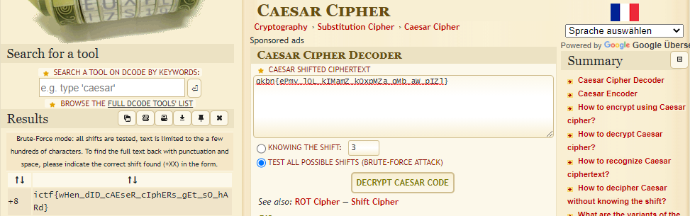

# Chicken Caesar Salad

|Author|Points|Category|Solves|
|---|---|---|---|
|FIREPONY57|50|Crypto|929|

### Description

```
I remember the good old days when Caesar ciphers were easy…	
```

### Attachments

```
https://imaginaryctf.org/r/5363-chicken-caesar-salad.txt

qkbn{ePmv_lQL_kIMamZ_kQxpMZa_oMb_aW_pIZl}
```
The challenges name gives away that this is caesar so we just go to: https://www.dcode.fr/caesar-cipher
and put in the provided text:



The output on the left side provides the solution.


There is our flag:
```
ictf{wHen_dID_cAEseR_cIphERs_gEt_sO_hARd}
```