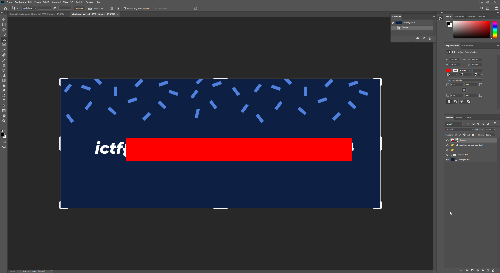

# Hidden

|Author|Points|Category|Solves|
|---|---|---|---|
|Astro|50|Forensics|740|

### Description

```
Oh no, someone hid my flag behind a giant red block! Please help me retrieve it!!	
```

### Attachments

```
https://imaginaryctf.org/r/10C4-challenge.psd
```
Well I have PS on my Host so I just opened the .psd and hid the layer with the red bar:




There is our flag:
```
ictf{wut_how_do_you_see_this}
```