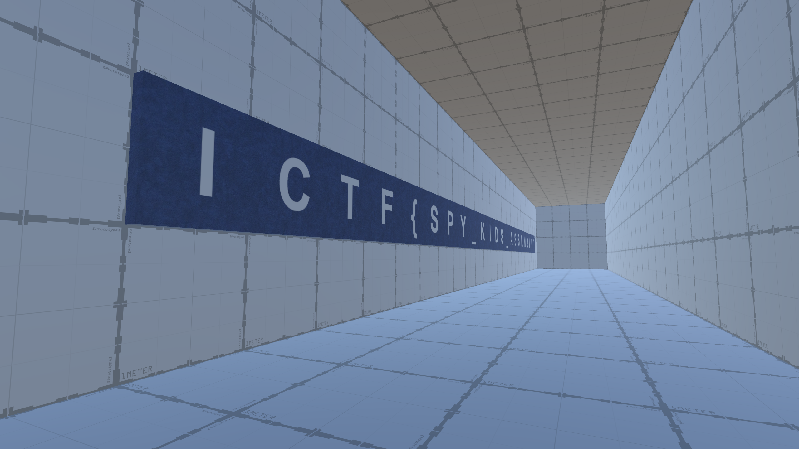

# Puzzle 2

|Author|Points|Category|Solves|
|---|---|---|---|
|Et3rnos|250|Misc|42|

### Description

```
The evil presidential candidate Et3rnos is now forcing this poor game's players to vote on him in order to access the flag room. Can you teach him a lesson and get access to it without voting on him? The flag is in the format ICTF{[A-Z_]+}	
```

### Attachments

```
https://imaginaryctf.org/r/64FA-puzzle_2.zip
```
Just open the process in [Cheat Engine](https://www.cheatengine.org/) and find the values that represent your X coordinate by moving around.
Make sure to search for any value and not only 4 bytes. You can narrow it down to approx. 42 values. Now just move in front of the wall of the hidden room and increase all these values by 2 to teleport into it.
It helps to pause the program while manipulating the values.




There is our flag:
```
ICTF{SPY_KIDS_ASSEMBLE}
```