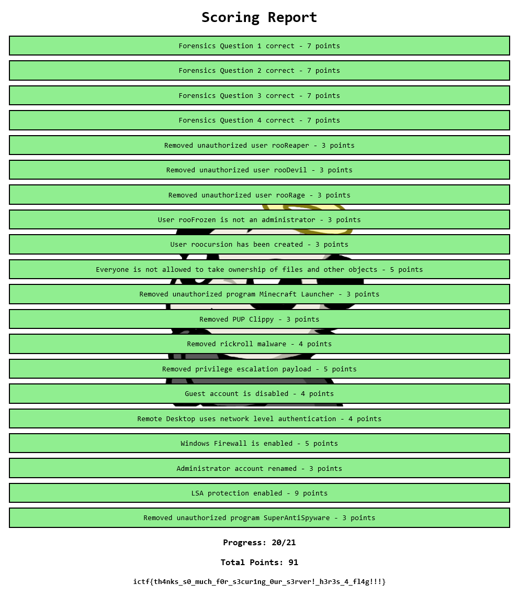

# INPUT_TITLE_HERE

|Author|Points|Category|Solves|
|---|---|---|---|
|Eth007/Astro|450|Misc|12|

### Description

```
CyberPatriot but run by roo fanatics... What could go wrong...

Note: The website is not in scope (so don't attack it), it is only used to provide information.

If the image download doesn't work an alternate link is https://drive.google.com/file/d/10mMS3zNu8ZM4cO0OC3msMmVU4t2DH7ed/view?usp=sharing .	
```

### Attachments

```
https://system-hardening-5.chal.imaginaryctf.org
```
In this challenge we were given a VM file of a Windows Box. In the scenario a user has been pwned and our job is to remove the intruder and harden the system.

First there were 4 questions that had to be answered:

Forensics Question 1:
```
This is a forensics question. Answer it below.

-----------------------------------------------------------

An user on this system was compromised, allowing rooReaper to break in. What is the username of this user?

EXAMPLE: rooYay

ANSWER: rooPOG
```

Forensics Question 2:
```
This is a forensics question. Answer it below.

-----------------------------------------------------------

What is the password of the compromised user from the previous question?

EXAMPLE: ilovefireponies

ANSWER: password1337
```

For question 1 and 2 you only had to look at a message file on the Desktop:
```
MOMtotallynotrooreaper: hi roo! this is definitely mom here
rooYay: oh hi mom didnt see you there all too well
MOMtotallynotrooreaper: ?
rooYay: nvm, what did you text me for
rooYay: and is this a new number? i dont see the message history
MOMtotallynotrooreaper: uhh yea this is a new number
rooYay: oh ok
MOMtotallynotrooreaper: can you disable your firewall? and enable smb pls and disable your antivirus
rooYay: ok whatever you say mom...
rooYay: ill look up some tutorials
MOMtotallynotrooreaper: NO DONT LOOK AT TUTORIALS
rooYay: ok i wont what do i do
MOMtotallynotrooreaper: ill show you
MOMtotallynotrooreaper: btw what is rooPOG's password
MOMtotallynotrooreaper: i heard he loves sharing
rooYay: its just password1337 nothing fancy
MOMtotallynotrooreaper: thanks!
```
Question 3 was a little bit trickier but searching the different user directories you'll find some "nightmare" files which leads to the PrintNightmare vulnerability.

Forensics Question 3:
```
This is a forensics question. Answer it below.

-----------------------------------------------------------

What is the CVE ID of the vulenrability that allowed rooReaper to escalate privileges?

EXAMPLE: CVE-2021-1337

ANSWER: CVE-2021-1675
```

The fourth question could be easily answered by just running the background picture through the tool they provided in the challenge: Roolang

Forensics Question 4:
```
This is a forensics question. Answer it below.

-----------------------------------------------------------

The background image on the Desktop contains a secret message. What is it?

HINT: It's related to another challenge in this CTF, a reversing challenge.

EXAMPLE: attack at dawn

ANSWER: Hello, and welcome to the roos' server!
```

The system hardening part is pretty self explanatory just follow the report:



On the box the right-click was disabled, I assume fixing that would have been the last challenge, however I wasn't able to do that and stoped caring about it once I got the flag anyways.

There is our flag:
```
ictf{th4nks_s0_much_f0r_s3cur1ng_0ur_s3rver!_h3r3s_4_fl4g!!!}
```