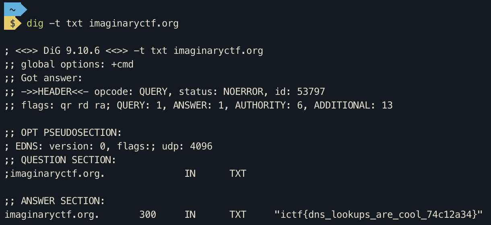

# Prechallenge: Buried Treasure

|Author|Points|Category|Solves|
|---|---|---|---|
|Eth007|999|Prechallenges|999|

### Description

```
There's a piece of buried treasure under the domain imaginaryctf.org. Can you dig it up?	
```

### Attachments

```
None
```
The challenges description already suggests to use dig so let's do:
```
dig -t txt imaginaryctf.org
```

and see the result:




There is our flag:
```
ictf{dns_lookups_are_cool_74c12a34}
```