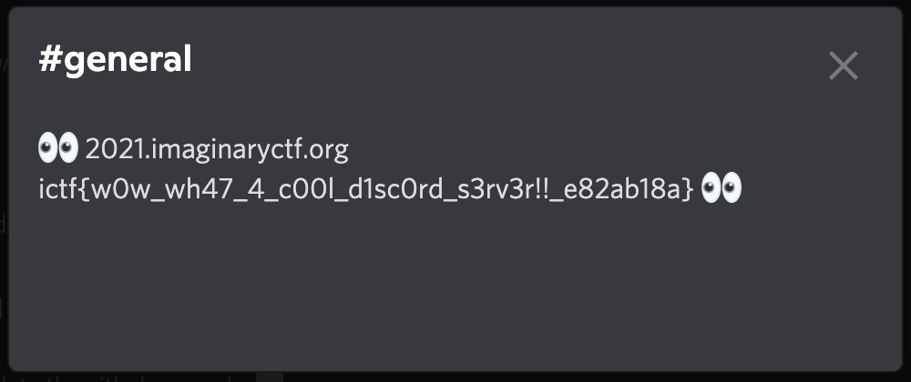

# Prechallenge: Discord

|Author|Points|Category|Solves|
|---|---|---|---|
|Astro|999|Prechallenges|999|

### Description

```
Welcome to ImaginaryCTF 2021! We are so glad to see you here a bit early, and while you are waiting for the CTF competition to start, you can solve our prechallenges just to get a feel for the platform.

Our Discord server is where the CTF is run. To get important announcements, and help from our mod team, join the server at https://discord.gg/vReKWNxPuE ! To get help on challenges, you can go to the #support-ticket channel.

A bonus to joining is that there are daily challenges in #ctf-challenge. These are not to be confused with ImaginaryCTF 2021, but they are just for fun, so you should check them out!

Once you have joined the discord server, find the flag in the description of the #general channel.	
```

### Attachments

```
https://discord.gg/vReKWNxPuE
```
Just as the Description says, just join the server and get the flag from the #general channels description:




There is our flag:
```
ictf{w0w_wh47_4_c00l_d1sc0rd_s3rv3r!!_e82ab18a}
```