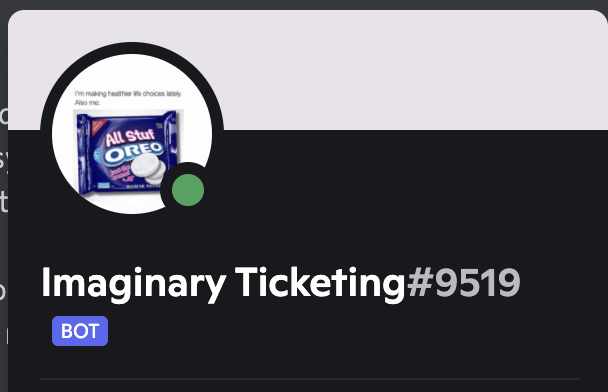

# Prechallenge: Support Tickets

|Author|Points|Category|Solves|
|---|---|---|
|Astro|999|Prechallenges|999|

### Description

```
Do you need help on a hard challenge? Don't worry, our mod team is here to help you. If at any time you have technical difficulties or clarification on a challenge, or reporting a bug/issue, you have two options: either make a support ticket (recommended), or press the green chat icon in the bottom right, and someone will help you there. To create a support ticket, go to our Discord server and go to the #support-ticket channel. Then press on an icon that best suits your needs.
```

### Attachments

```
The flag for this challenge is the Discord name and tag of the Tickets bot used in #support-ticket. Be sure to wrap it in the flag format, ictf{.*}. (for example, Astro#1779, the answer would be ictf{Astro#1779})
```

On their [Discord Server](https://discord.gg/vReKWNxPuE) locate the #support-ticket channel and find the support bot:



So our flag is:
```
ictf{Imaginary Ticketing#9519}
```