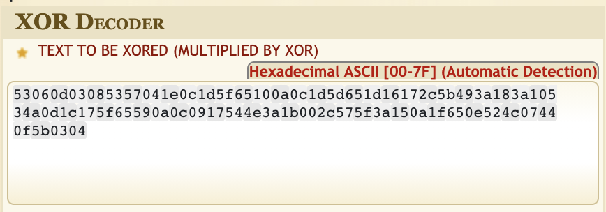
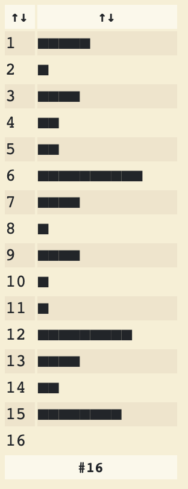
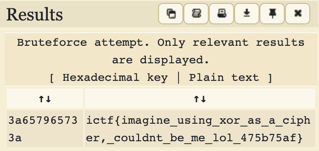

# Prechallenge: XOR

|Author|Points|Category|Solves|
|---|---|---|
|Eth007|50|Prechallenges|999|

### Description

```
I XORed my flag with a key, using repeated key XOR. The flag is in the format ictf{i.*}. The ciphertext, base64 encoded, is below.	
```

### Attachments

```
UwYNAwhTVwQeDB1fZRAKDB1dZR0WFyxbSToYOhBTSg0cF19lWQoMCRdUTjobACxXXzoVCh9lDlJMB0QPWwME
```

I used [this site](https://www.dcode.fr/xor-cipher) and put the given string as input after decoding it from base64 and encoding it as hex:



Next I analyzed the key length:



So 6 is propably the key length, let's use that information and try to brute it:



There is our flag:
```
ictf{imagine_using_xor_as_a_cipher,_couldnt_be_me_lol_475b75af}
```