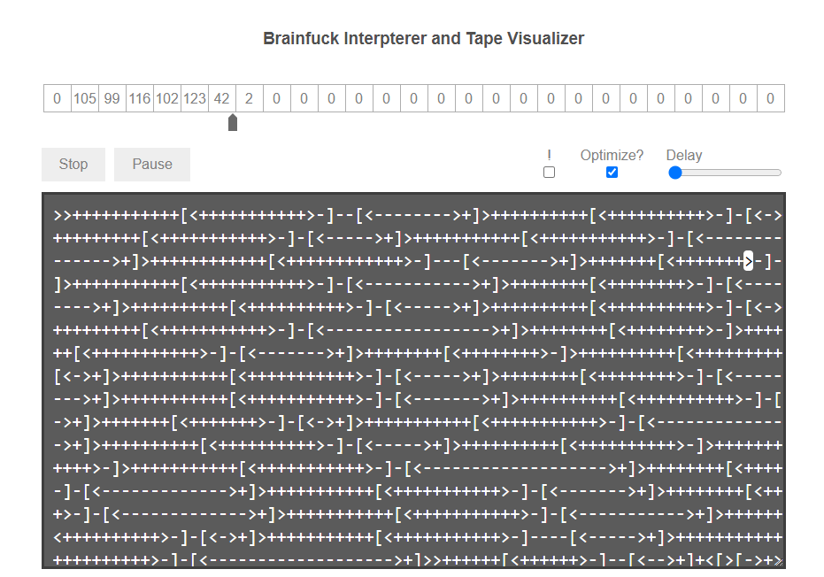

# No Thoughts, Head Empty

|Author|Points|Category|Solves|
|---|---|---|---|
|puzzler7|200|Reversing|101|

### Description

```
When I was making Roolang, of course I took a look at the mother of all esolangs! So, have some bf code. Run it here (https://copy.sh/brainfuck/) with 32 bit cells and dynamic memory enabled. Run the program to get the flag, and then some.	
```

### Attachments

```
https://imaginaryctf.org/r/8A7A-flag_min.bf
```
Just use: https://fatiherikli.github.io/brainfuck-visualizer/
The numbers on the tape are the decimals for the flag. if you run out of memore just delete some from the start and rerun it.




There is our flag:
```
ictf{0n3_ch@r@ct3r_0f_d1f3r3nce}
```