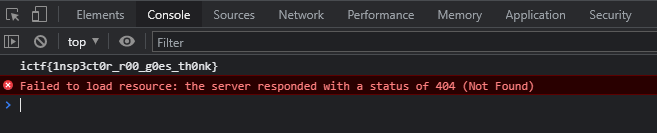

# Roos World

|Author|Points|Category|Solves|
|---|---|---|---|
|FIREPONY57|50|Web|853|

### Description

```
Somebody hid Roo's flag on his website. Roo really needs some help.	
```

### Attachments

```
http://roos-world.chal.imaginaryctf.org
```
When you open the website, you'll find the flag in the console of the Developer Tools from Chrome:




There is our flag:
```
ictf{1nsp3ct0r_r00_g0es_th0nk}
```